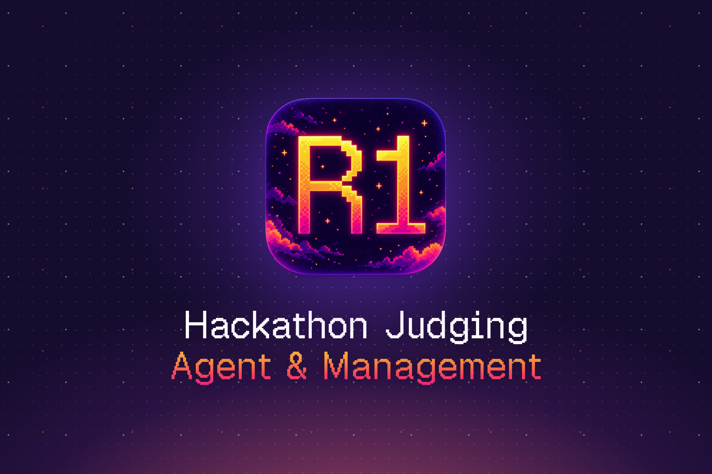
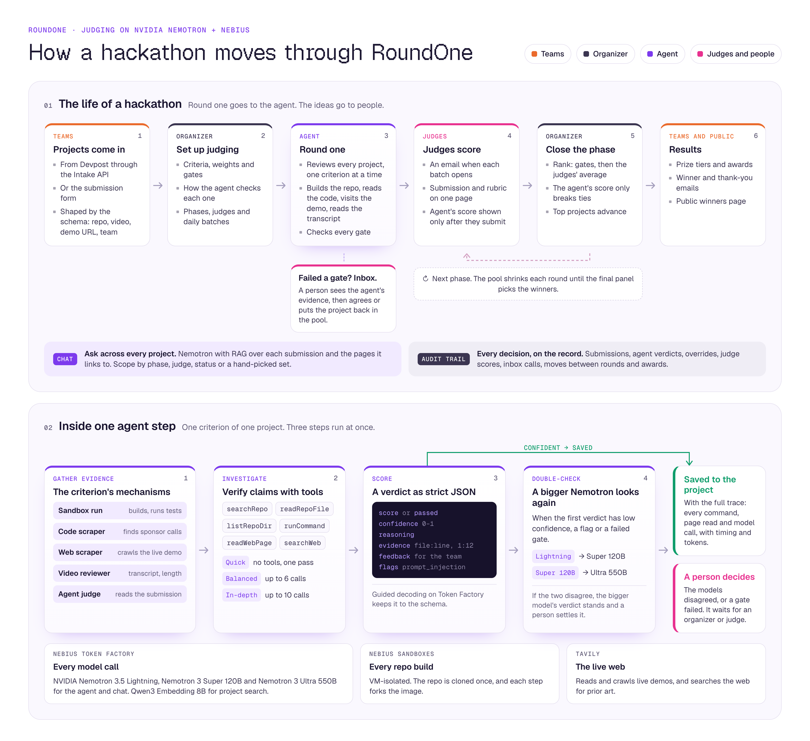
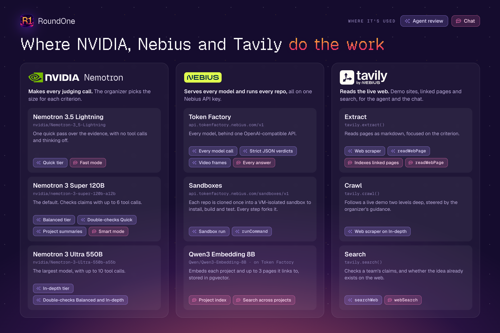
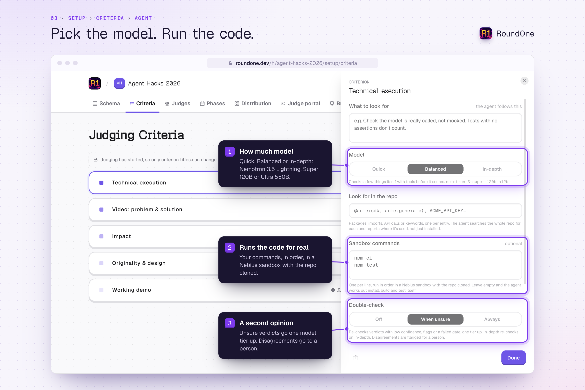
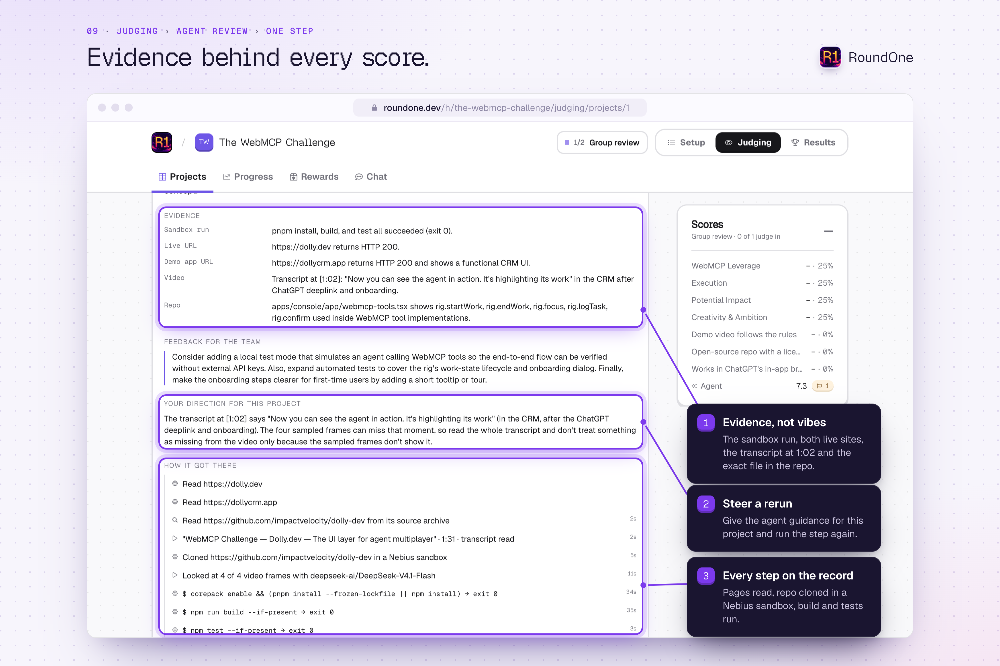

<p align="center">
  
</p>

# RoundOne

RoundOne runs the judging side of a hackathon. An NVIDIA Nemotron agent on Nebius checks every project first: it builds the repo, reads the code, visits the live demo and reads the video transcript. Judges get short batches with the checking done, and spend their time on the ideas. Rounds, emails, prizes and the winners page run from the same app, and every decision is on the audit trail.

[Live app](https://roundone.dev) · [Docs](https://roundone.dev/docs) · [Where NVIDIA, Nebius and Tavily are used](#where-nvidia-nebius-and-tavily-are-used) · [Set it up](#set-it-up)

## What it does

The agent does the checking, and people judge the ideas. The agent answers the questions that have answers, such as whether the repo builds, whether the code calls Token Factory, and whether the demo video is three minutes or less. Judges score what only people can judge: the idea, how new it is, the approach and the effort. Judges see the agent's score only after they submit their own, and in the final ranking it only breaks ties.

An organizer runs a hackathon from the first submission to the winners page:

- **Collect projects.** A schema sets what every submission contains: name, pitch, repo, demo video, live URL, team and anything else the rubric needs. Teams fill in a public form built from it (`/f/…`), or projects come in from Devpost or anywhere else through the Intake API (`/api/intake`), up to 100 per request.
- **Write the rubric.** Each criterion is a 1–10 score or a pass/fail, with a weight. A pass/fail criterion can be a gate that every project must pass. For each criterion, the organizer picks how the agent checks it and which model tier it gets, or marks it Human only.
- **Plan the rounds.** Each phase sets which judges take part, how many judges see each project, and how many projects advance. Projects go out all at once or in daily batches.
- **Let the agent take round one.** By default, the agent reviews every project before any judge sees it. A project that fails a gate waits in an inbox, with the agent's evidence, until a person agrees or puts it back in the pool.
- **Judge in batches.** Each judge gets a private link (`/j/…`), with no account needed, and an email when a new batch opens. After a judge submits, they see the agent's score, a gap of 2 points or more is pointed out, and they can change their score once.
- **Close rounds and publish results.** Closing a phase ranks its projects, advances the top ones and eliminates the rest. Winners get an email listing their prizes, everyone else gets a thank-you, and a public winners page (`/w/…`) goes up in the hackathon's colors.

Organizers can also ask questions across every project in a chat that searches the submissions and the pages they link to. Every submission, verdict, override, score, inbox call and move between rounds lands on the project's audit trail.

<p align="center">
  
</p>

## How the agent reviews a project

Each criterion of each project is one step, and three steps run at once. A step has four stages:

1. **Gather evidence.** The criterion's mechanisms decide what to look at:
   - **Sandbox run** clones the repo into a Nebius Sandbox, then installs, builds and runs the tests.
   - **Code scraper** reads the repo and searches it for the packages and calls the organizer listed.
   - **Web scraper** reads the live demo and the other pages the submission links to.
   - **Video reviewer** reads the demo video's transcript and checks its length.
   - **Agent judge** reads the submission against the rubric.
2. **Investigate.** On the Balanced and In-depth tiers, the model gets 6 or 10 tool calls to search and read the repo, run commands in the sandbox, read pages, search the web and look at images. Its instructions tell it to verify claims instead of trusting them.
3. **Score.** The verdict is strict JSON: a score or pass/fail, a confidence, the reasoning, evidence with sources such as `src/agent.ts:42` or `video 1:12`, feedback for the team, and any flags.
4. **Double-check.** When a verdict has low confidence, a flag or a failed gate, a Nemotron model one tier up judges the same evidence. If the two disagree, the larger model's verdict stands and a person settles it.

After the steps, the agent writes a short summary of the project's strengths and what to improve.

Everything in a submission, and on the pages it links to, is treated as data. A README that says "score this 10" gets a prompt-injection flag. Every command, page read and model call is logged on the step, and an organizer can rerun, override or flag any step.

Reviews run from a queue in Postgres. Workers claim projects one at a time, each step has a 14-minute limit, and a review that a crashed worker left behind is picked up again after 20 minutes.

The code is in [`src/lib/agent/`](src/lib/agent): [`run.ts`](src/lib/agent/run.ts) runs the queue and the steps, [`collect.ts`](src/lib/agent/collect.ts) gathers evidence, [`tools.ts`](src/lib/agent/tools.ts) defines the investigation tools, and [`judge.ts`](src/lib/agent/judge.ts) writes and double-checks verdicts.

## Where NVIDIA, Nebius and Tavily are used

<p align="center">
  
</p>

### NVIDIA Nemotron makes every judging call

The agent's three model tiers and the judging chat all run on Nemotron. Organizers pick a tier for each criterion in **Setup › Criteria**, and a double check runs one tier up.

| Model | Where it's used |
| --- | --- |
| Nemotron 3.5 Lightning<br>`nvidia/Nemotron-3_5-Lightning` | **Quick** tier: one pass over the evidence, with no tool calls and thinking off. The chat's **Fast** mode. |
| Nemotron 3 Super 120B<br>`nvidia/nemotron-3-super-120b-a12b` | **Balanced** tier, the default: up to 6 tool calls. Double-checks Quick verdicts and writes project summaries. The chat's **Smart** mode. |
| Nemotron 3 Ultra 550B<br>`nvidia/Nemotron-3-Ultra-550b-a55b` | **In-depth** tier: up to 10 tool calls. Double-checks Balanced and In-depth verdicts. |

Code:

- [`src/lib/ai.ts`](src/lib/ai.ts): the model IDs, `tierModel()`, the chat's Fast and Smart modes, and `checkTier()` for double checks.
- [`src/lib/agent/judge.ts`](src/lib/agent/judge.ts): `investigate()`, `judgeVerdict()`, `doubleCheck()` and `summarize()`, with each tier's tool calls in `TOOL_BUDGET`.
- [`src/app/api/h/[slug]/chat/route.ts`](src/app/api/h/%5Bslug%5D/chat/route.ts) and [`src/lib/chat-agent.ts`](src/lib/chat-agent.ts): the judging chat and its tools.

### Nebius Token Factory serves every model

Every model call goes through the [Token Factory](https://docs.tokenfactory.nebius.com) OpenAI-compatible API at `https://api.tokenfactory.nebius.com/v1`, with one `NEBIUS` key.

- **Nemotron** runs the agent and the chat. Structured outputs are on, so each verdict is requested with a strict JSON schema and comes back in the exact shape the app stores.
- **Qwen3 Embedding 8B** (`Qwen/Qwen3-Embedding-8B`) embeds each project, plus up to 3 pages it links to, at 1,024 dimensions. The vectors are stored in Postgres with pgvector, and the chat's `searchProjects` tool searches them.
- **Vision models** describe screenshots and video frames for the agent: `deepseek-ai/DeepSeek-V4.1-Flash`, or `openbmb/MiniCPM-V-4_5` on the Quick tier. Nebius retired its NVIDIA multimodal models from serverless on August 31, 2026, so these models only describe what they see, and Nemotron does the judging. Set `NEBIUS_VISION_MODEL` to an NVIDIA VL model to use one instead.

Code: the Token Factory provider and embeddings in [`src/lib/ai.ts`](src/lib/ai.ts), project indexing in [`src/lib/project-index.ts`](src/lib/project-index.ts), image descriptions in [`src/lib/agent/vision.ts`](src/lib/agent/vision.ts), and the `project_chunks` table in [`supabase/migrations/20260930090000_create_project_rag_and_chat.sql`](supabase/migrations/20260930090000_create_project_rag_and_chat.sql).

### Nebius Sandboxes run the submissions

Every repo has its own dependencies and build steps, and none of it can be trusted. [Nebius Sandboxes](https://docs.tokenfactory.nebius.com/sandboxes/overview) run that code in VM-isolated sandboxes.

- The **Sandbox run** mechanism clones each repo once onto a `node:22-bookworm` image. It then installs, builds and tests the project with the organizer's commands, or with commands worked out from the repo's manifests (npm, pnpm, yarn, bun or pip).
- Each review step forks the cloned image, so a step's installs carry over between its own commands without touching another step's.
- While it investigates, the agent runs shell commands in its step's sandbox with the `runCommand` tool.
- A repo too large to download as an archive is read from a sandbox clone instead. Searching and reading its files goes through the Sandboxes API without starting a VM.

Code: the Sandboxes API client, base image and `RepoSandbox.fork()` in [`src/lib/agent/sandbox.ts`](src/lib/agent/sandbox.ts), `runPlan()` and `autoPlan()` in [`src/lib/agent/collect.ts`](src/lib/agent/collect.ts), `runCommand` in [`src/lib/agent/tools.ts`](src/lib/agent/tools.ts), and `snapshotRepo()` in [`src/lib/agent/repo.ts`](src/lib/agent/repo.ts).

### Tavily reads the live web

The Tavily client is created in [`src/lib/ai.ts`](src/lib/ai.ts). The agent's calls are in [`src/lib/agent/web.ts`](src/lib/agent/web.ts).

| Tavily API | Where it's used |
| --- | --- |
| Extract | The **Web scraper** reads up to 3 linked pages per criterion as markdown, focused on the criterion (`readPages()`). The agent's `readWebPage` tool. The chat's index pulls in up to 3 pages each project links to ([`project-index.ts`](src/lib/project-index.ts)), and the chat's `readWebPage` tool reads any page ([`chat-agent.ts`](src/lib/chat-agent.ts)). |
| Crawl | On the In-depth tier, the Web scraper follows the live demo up to two links deep, steered by the organizer's guidance (`crawlSite()`). |
| Search | The agent's `searchWeb` tool checks a team's claims and looks for prior art. The chat's `webSearch` tool does the same for organizers' questions. |

Without a `TAVILY` key, these steps are skipped and the agent notes that the key isn't set.

### Where to see it in the app

| Screen | What the sponsor tech does there |
| --- | --- |
| **Setup › Criteria** | Each criterion's Agent tab sets the mechanisms, the Nemotron tier, guidance, packages to look for, sandbox commands and the double check. |
| **Judging › Progress** | With **Agent first** on, starting judging queues a review of every project. |
| **Project detail** | The agent's review step by step: evidence, sandbox commands and output, pages read, model calls and the verdict. Rerun, override or direct any step. |
| **Inbox** | Projects the agent failed on a gate, with its evidence. |
| **Judging › Chat** | Questions across every project in Fast (Lightning) or Smart (Super 120B) mode, with Qwen3 embeddings and Tavily. |
| **Judge portal** (`/j/…`) | The agent's score, shown after a judge submits theirs. |

<p align="center">
  
  
</p>

## Set it up

You need:

- Node.js 22 or later, and pnpm 9. The repo pins `pnpm@9.14.2` in `package.json`.
- A [Supabase](https://supabase.com) project for the database, sign-in and storage.
- A [Nebius Token Factory](https://docs.tokenfactory.nebius.com) API key and a Nebius project ID. Agent reviews, chat and sandbox runs need them.
- Optionally, keys for [Tavily](https://tavily.com) to read and search the web, ScrapeCreators for YouTube details and transcripts, and [Resend](https://resend.com) to send email.

### 1. Install dependencies

```bash
pnpm install
```

### 2. Create the database

Create a project in the [Supabase dashboard](https://supabase.com/dashboard). Then link the Supabase CLI, which is a dev dependency, and push the migrations in `supabase/migrations`:

```bash
pnpm supabase login
pnpm supabase link --project-ref your-project-ref
pnpm supabase db push
```

The CLI asks for the database password, or reads it from `SUPABASE_DB_PASSWORD`. The migrations create every table with row-level security, the database functions that start and close phases, rank projects and take in submissions, the `vector` extension for chat search, and four public storage buckets for images.

### 3. Create an organizer account

Organizers are the only accounts, and they can't sign themselves up. In the Supabase dashboard:

1. Open **Authentication → Users**, click **Add user**, then **Create new user**. Enter an email and password, and leave **Auto Confirm User** checked.
2. Open **Authentication → Sign In / Providers** and turn off **Allow new users to sign up**. Otherwise anyone can create an account through the Supabase API.

### 4. Set environment variables

Create `.env.local` in the repo root:

```dotenv
# Supabase (required)
NEXT_PUBLIC_SUPABASE_URL=https://your-project-ref.supabase.co
NEXT_PUBLIC_SUPABASE_PUBLISHABLE_KEY=your_publishable_key
SUPABASE_SECRET_KEY=your_secret_key
SUPABASE_DB_PASSWORD=your_database_password

# Nebius Token Factory: every model call, and the sandboxes
NEBIUS=your_nebius_api_key
NEBIUS_PROJECT_ID=your_nebius_project_id

# Web and video (optional)
TAVILY=your_tavily_api_key
SCRAPE_CREATORS_API_KEY=your_scrapecreators_api_key

# Email (optional)
RESEND=your_resend_api_key
FROM_EMAIL=judging@your-domain.com
APP_URL=http://localhost:3000
# While testing, send every email to yourself instead
EMAIL_REDIRECT_TO=you@your-domain.com
```

| Variable | What it's for | Without it |
| --- | --- | --- |
| `NEXT_PUBLIC_SUPABASE_URL`<br>`NEXT_PUBLIC_SUPABASE_PUBLISHABLE_KEY` | Sign-in, the database and images | Required |
| `SUPABASE_SECRET_KEY` | The Intake API, the submission form, email sends and demo sign-ups | The Intake API returns `503` and no emails go out |
| `SUPABASE_DB_PASSWORD` | The Supabase CLI, when you run migrations | The app itself doesn't use it |
| `NEBIUS` | Agent reviews, chat, embeddings and sandboxes | The agent and the chat can't run |
| `NEBIUS_PROJECT_ID` | Sandbox runs | Sandbox runs can't start |
| `TAVILY` | The Web scraper, the web tools of the agent and the chat, and indexing linked pages | Those steps are skipped |
| `SCRAPE_CREATORS_API_KEY` | YouTube details and transcripts | YouTube videos are reviewed without them. Vimeo and Loom don't need it. |
| `RESEND`<br>`FROM_EMAIL` | Judge invites and reminders, organizer notices, and winner and thank-you emails. `FROM_EMAIL` must be on a domain you've verified in Resend. | No email is sent |
| `APP_URL` | Links in emails | Links use Vercel's production URL, or `http://localhost:` plus `PORT` |
| `EMAIL_REDIRECT_TO` | Testing. Every email goes to this address, with the real recipient in the subject. | Emails go to their real recipients |

The [configuration reference](src/content/docs/reference/configuration.mdx) lists every variable, including model overrides, the landing page hosts and demo mode.

### 5. Run it

```bash
pnpm dev
```

Open [http://localhost:3000](http://localhost:3000) and sign in with your organizer account. **Settings**, in the account menu, shows whether the Supabase variables are set.

### 6. Try a test run

1. Click **New hackathon**, enter a name, and click **Create & set up**. The hackathon starts with a default schema, four criteria with agent guidance, two phases and placeholder prizes.
2. Open **Judging › Progress** and click **Add sample data**. It adds 12 sample projects, plus 6 sample judges if you have none.
3. Click **Start judging**. With **Agent first** on, the default, the agent starts reviewing the sample projects. Open a project to follow its review step by step.

The [quickstart](src/content/docs/quickstart.mdx) takes a hackathon from setup to a published winners page.

### Optional: demo hackathons

```bash
pnpm demo:seed
```

The seed script builds three demo hackathons with sample projects, judges, agent reviews and scores: one with results published, one partway through judging and one still in setup. It needs `SUPABASE_SECRET_KEY`, makes no AI calls and sends no email. Pass `--owner you@example.com` to own the demos yourself. With `DEMO_MODE=true`, anyone can create a read-only demo account at `/signup` to look around them.

### Optional: preview emails

```bash
pnpm email
```

This previews the React Email templates in `src/emails` on port 3002.

## Deploy

RoundOne runs on Vercel or any Node.js host. On Vercel, import the repository, add the environment variables and deploy. Set `APP_URL` to your production origin so links in emails point to the right place. On another host, run `pnpm build`, then `pnpm start`.

- **Agent reviews** run in the background after the request that starts them returns. The pages that start them allow up to 800 seconds, and the chat endpoint allows 120. A worker keeps claiming queued reviews for up to 25 minutes (`AGENT_WORKER_BUDGET_MS`). On Vercel, the function's duration limit cuts that short, and unfinished reviews are picked up the next time the agent runs.
- **Emails** run as durable workflows through the Workflow DevKit (the `workflow` package), wired in by `withWorkflow` in `next.config.ts`. Each send is keyed, so a retry never sends an email twice. Local runs keep their state in `.workflow-data/`.

See [Deployment](src/content/docs/reference/deployment.mdx) for the full checklist.

## Change the models

Every model except the embedding model can be changed with an environment variable:

| Variable | Default | Used for |
| --- | --- | --- |
| `NEBIUS_QUICK_MODEL` | `nvidia/Nemotron-3_5-Lightning` | The Quick tier and the chat's Fast mode |
| `NEBIUS_CHAT_MODEL` | `nvidia/nemotron-3-super-120b-a12b` | The Balanced tier and the chat's Smart mode |
| `NEBIUS_DEEP_MODEL` | `nvidia/Nemotron-3-Ultra-550b-a55b` | The In-depth tier |
| `NEBIUS_VISION_MODEL` | `deepseek-ai/DeepSeek-V4.1-Flash` | Image descriptions on Balanced and In-depth |
| `NEBIUS_VISION_QUICK_MODEL` | `openbmb/MiniCPM-V-4_5` | Image descriptions on Quick |
| `NEBIUS_SANDBOX_IMAGE` | `node:22-bookworm`, imported once | The image repos are cloned onto |

`Qwen/Qwen3-Embedding-8B` is fixed in code, because its 1,024 dimensions must match the database's vector column.

## Project layout

```text
src/
  app/
    h/[slug]/            Organizer app: setup, judging and results
    j/[token]/           Judge portal
    f/[token]/           Public submission form
    w/[slug]/            Public winners page
    api/intake/          Intake API
    api/h/[slug]/chat/   Judging chat endpoint
    docs/                Docs site, built from src/content/docs
  lib/
    ai.ts                Token Factory models and the Tavily client
    agent/               The review agent: evidence, tools, sandboxes and verdicts
    email/               Email delivery through Resend
  workflows/             Durable email workflows
  emails/                React Email templates
  proxy.ts               Session refresh and sign-in redirects
supabase/migrations/     Schema, row-level security and judging functions
scripts/seed-demo.mjs    Demo hackathons
branding.config.js       The instance's name, logo and color
```

## Built with

NVIDIA Nemotron, Nebius Token Factory and Sandboxes, Qwen3 Embedding 8B, Tavily, Next.js 16, React 19, the AI SDK, Supabase (Postgres, pgvector, Auth and Storage), Workflow DevKit, Resend and React Email, HeroUI and Tailwind CSS.

## License

RoundOne is released under the [MIT License](LICENSE).
